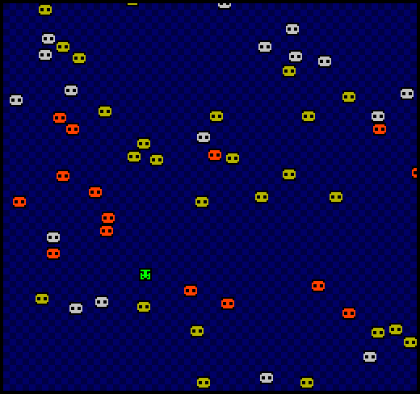

# FANdemic

Author: Thomas Wrabetz

Design: Control your rockstar (the green sprite) to convert as many fans as possible to your cause! Touch the orange fans with no music-taste to convert them into tasteful lime-colored fans.

Screen Shot:

How Your Asset Pipeline Works:

(TODO: describe the steps in your asset pipeline, from source files to tiles/backgrounds/whatever you upload to the PPU466.)

PNGToBinary takes the png and converts it to the bit1 array for sprites (each sprite has only 2 colors so only 1 bit is saved). Note it only checks whether the color is black, it's noting down black vs everything else. This is saved into the .sprt files in the "binaries" folder. LoadBinary loads the files in the binaries folder to get bit1 arrays, which are then saved into variables in PlayMode.cpp and used for the sprites.

How To Play:

arrow keys. Touch the orange enemies. If there is no more orange, you won.

Sources: no outside sources apart from looking at APIs.

This game was built with [NEST](NEST.md).

